# flutter_plugin_pubdev

A new Flutter project.

## Getting Started

Nama: Tyase Nisa'an Jamilaa

Absen: 26

Kelas: 3H

---

# Tugas Praktikum

1. Selesaikan Praktikum tersebut, lalu dokumentasikan dan push ke repository Anda berupa screenshot hasil pekerjaan beserta penjelasannya di file README.md!

# Pengerjaan

## **Langkah 1: Buat Project Baru**

## **Langkah 2: Menambahkan Plugin**

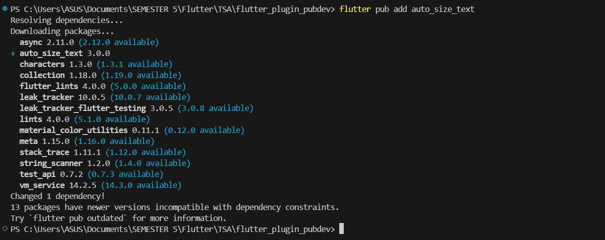

## **Langkah 3: Buat File red_text_widget.dart**

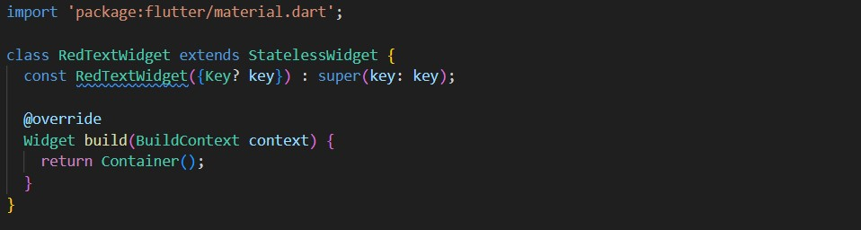

## **Langkah 4: Tambah Widget AutoSizeText**

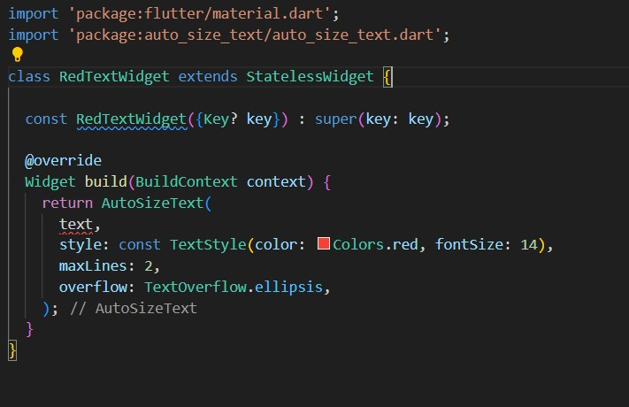

## **Langkah 5: Buat Variabel Text dan Parameter di Constructor**

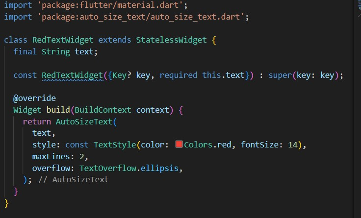

## **Langkah 6: Tambahkan Widget di main.dart**

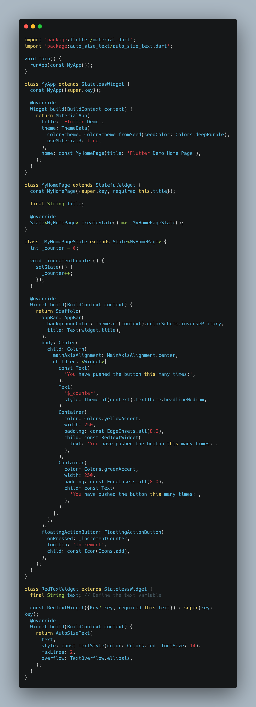

Hasil:

---

2. Jelaskan maksud dari langkah 2 pada praktikum tersebut!

**Jawab:**

Perintah flutter pub add auto_size_text adalah cara cepat dan efisien untuk menambahkan paket auto_size_text ke proyek Flutter Anda, yang memungkinkan penggunaan widget untuk teks yang secara otomatis menyesuaikan ukurannya agar sesuai dengan ruang yang tersedia.

---

3. Jelaskan maksud dari langkah 5 pada praktikum tersebut!

**Jawab**

Kode ini mendefinisikan konstruktor dari kelas RedTextWidget, yang memerlukan input teks (diberikan melalui parameter text). Dengan menggunakan final, nilai teks tidak bisa diubah setelah inisialisasi, dan kata kunci const memungkinkan objek ini untuk digunakan dalam konteks yang memerlukan konstanta, seperti dalam build method yang dioptimalkan.

---

4. Pada langkah 6 terdapat dua widget yang ditambahkan, jelaskan fungsi dan perbedaannya!

**Jawab**

Perbedaan Antara Kedua Widget

Penyesuaian Ukuran Teks:

- RedTextWidget menggunakan AutoSizeText (melalui auto_size_text package), sehingga ukuran teks akan otomatis menyesuaikan berdasarkan ruang yang tersedia, menghindari pemotongan teks.

- Text adalah widget dasar yang tidak secara otomatis menyesuaikan ukuran teks jika ruang yang tersedia terbatas.

Lebar Container:

- RedTextWidget ditempatkan di dalam Container dengan lebar 50 piksel, yang sangat kecil, tetapi karena AutoSizeText bisa menyesuaikan ukuran teks, teks tetap bisa ditampilkan dengan ukuran lebih kecil.

- Text ditempatkan dalam Container dengan lebar 100 piksel, yang lebih besar dari 50 piksel, namun tetap tidak ada jaminan teks tidak akan terpotong jika teks terlalu panjang.

Tampilan Visual:

- Secara visual, teks di dalam RedTextWidget bisa menjadi lebih kecil, namun tetap lengkap.

- Teks di dalam Text mungkin akan terlihat normal, tetapi dengan risiko pemotongan atau overflow jika ruang tidak mencukupi.

---

5. Jelaskan maksud dari tiap parameter yang ada di dalam plugin auto_size_text berdasarkan tautan pada dokumentasi ini !

# auto_size_text package

### Usage

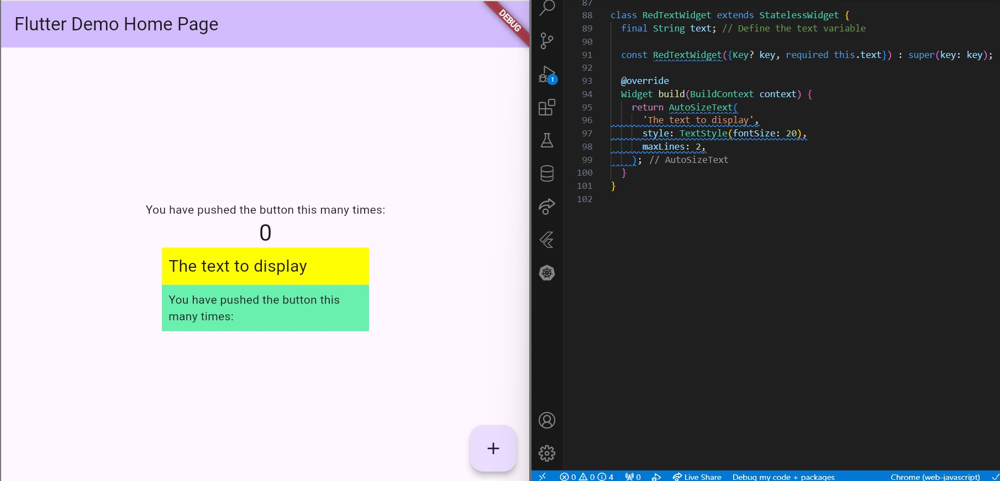

### maxLines

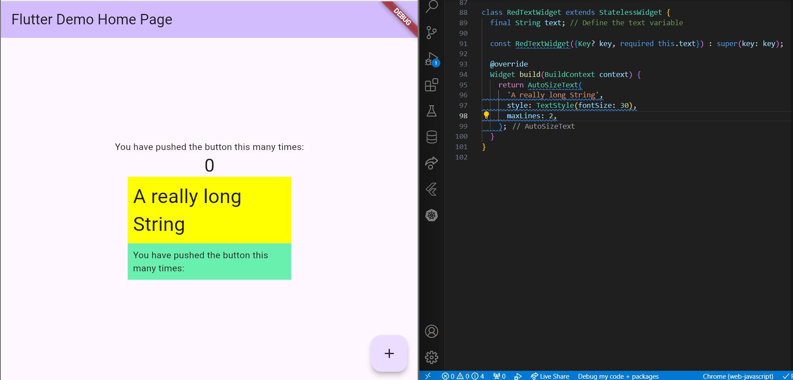

### minFontSize & maxFontSize

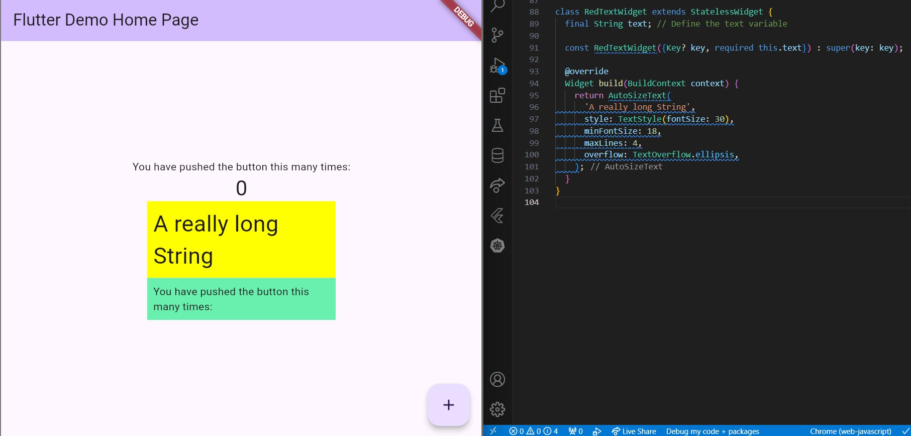

### Group

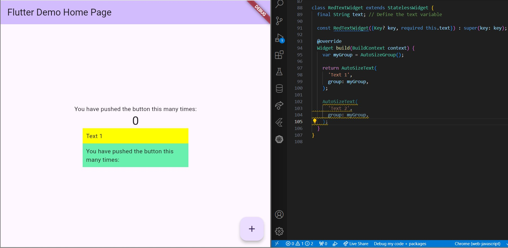

### stepGranularity

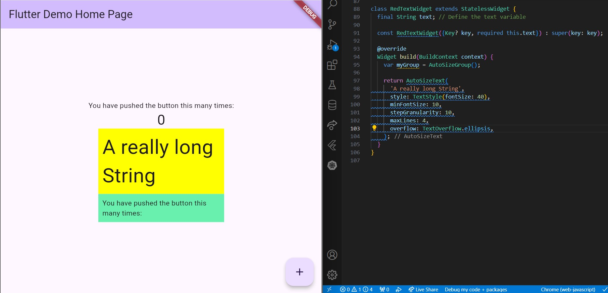

### presetFontSize

### overflowReplacement

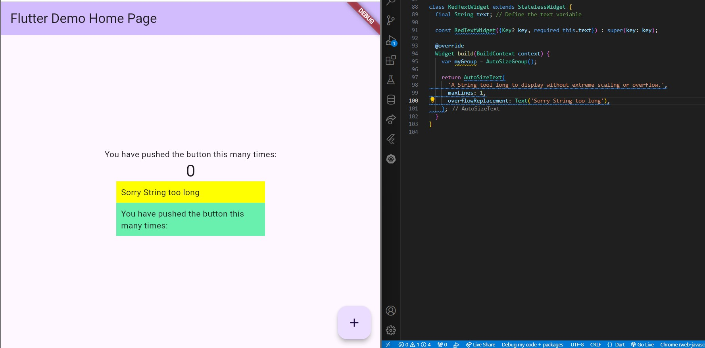

### Rich Text

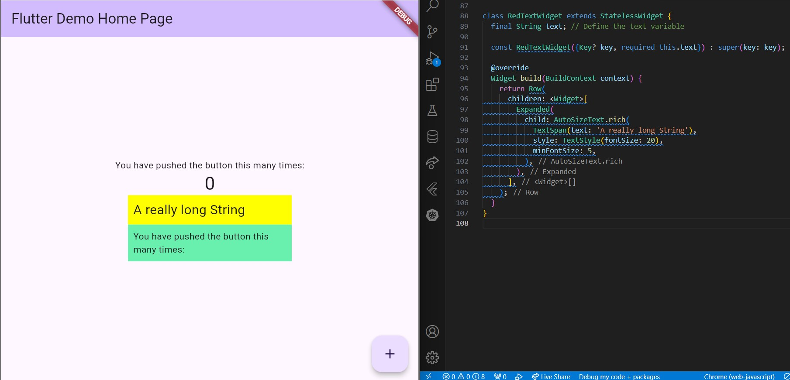

### Parameters

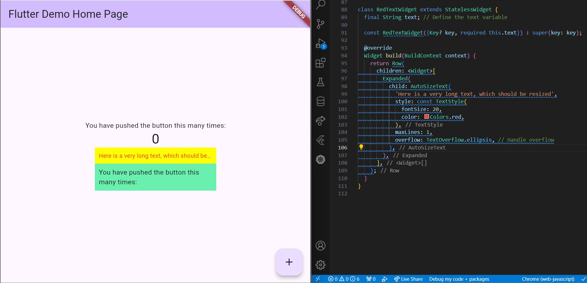

### Performance

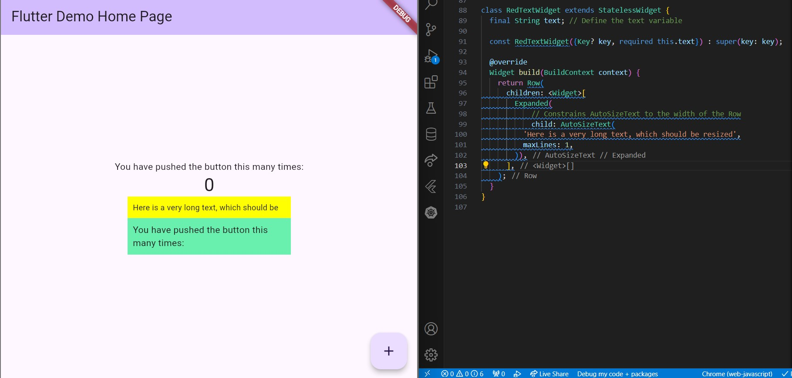

### Troubleshooting

Missing bounds

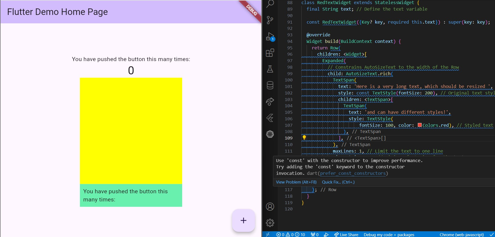

MinFontSize too large

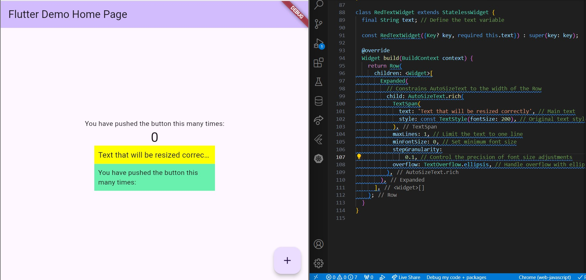

6. Kumpulkan laporan praktikum Anda berupa li/nk repository GitHub kepada dosen!

---
